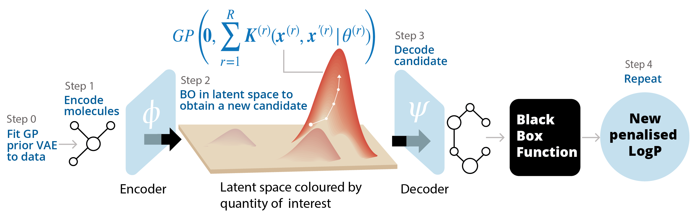

High-Dimensional Bayesian Optimisation with Gaussian Process Prior Variational Autoencoders
===========================================================================================
This repository contains the reference implementation of the method described in our paper.

Overview
--------
In this work, we introduce a conditional generative model for efficient high-dimensional Bayesian Optimisation, leveraging a Gaussian Process surrogate model alongside Gaussian Process prior Variational Autoencoders. Our approach integrates observed target values as auxiliary covariates, learning a structured latent space that enhances compatibility with the GP-based BO surrogate model. It effectively handles partially observed auxiliary covariates within a unified probabilistic framework and seamlessly incorporates additional covariates that may arise in real-world applications.

  
the firgure considers the example application of discovering novel drug-like molecules. Our method uses a GP prior VAE with an additive kernel over various partially observed auxiliary covariates, such as molecular weight, number of hydrogen bonds, total polar surface area, etc., and the partially observed quantity of interest (represented by $x^{(r)}$ in this image for the $r^\text{th}$ additive kernel) to learn a structured latent space. The black-box function evaluates the quantity of interest for the chosen molecule.

Description of files
------------------------
- **GP_VAE_BO.py**: This is the root file for the reference implementation of our method.
- **BO_functions.py**: This implements the Bayesian Optimisation steps leveraging BoTorch.
- **dataset_def.py**: This file specifies the datasets used by the Dataloaders.
- **elbo_functions.py**: This implements the evidence lower bounds described in detail in Section A.1 of the Appendices.
- **GP_def.py**: This defines the base definition for the Gaussian process prior.
- **kernel_gen.py**: Based on the config file, this script generates the additive Gaussian process prior.
- **kernel_spec.py**: This file contains the definitions for the GP kernels. It is easily extensible.
- **parse_model_args.py**: This contains a helper function to parse the config file (see config/sample_config.txt).
- **training.py**: This implements the overall training steps described in Algorithm 1 of the manuscript.
- **VAE.py**: This file defines the neural network architecture (both encoder and decoder architecture) of the Variational Autoencoder.
- **weighted_retraining/**: As mentioned in our manuscript, this folder contains modified scripts from Grosnit et. al, (2021). This scripts have been modified for the method described in our manuscript. We leverage their concise implementation for the expressions as well as penalised logP experiments.

Running the reference implementation
------------------------------------

- Create results folder.
- Create datasets folder.
- Populate config file (as shown in /config/sample_config.txt)
- Run using:

      python GP_VAE_BO.py --f=./config/config_file.txt --GP_VAE=True